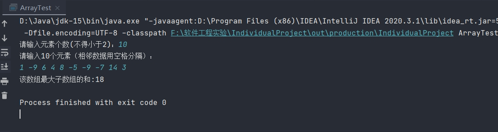

## **实验一（第1次上机）：Individual project** 

一、实验目的及要求：

1、学会使用开源平台Github，创建git账号，使用git工具存放源程序和文档

2、掌握个人软件流程（PSP）,熟练使用开发环境和测试工具

二、任务说明：

1、使用git工具。创建git账号，在本地配置git环境.

2、个人项目实践。编程实现子数组问题，完成PSP评估表。

问题说明：
给定一个整数数组，计算该数组最大子数组的和
代码如下：

import java.util.Scanner;

public class ArrayTest {

    Scanner SC = new Scanner(System.in);//创建输入流对象
    public static void main(String[] args) {
        ArrayTest arrayTest = new ArrayTest();//初始化
    }
    //构造方法，获取数组元素
    public ArrayTest(){
        System.out.print("请输入元素个数(不得小于2)：");
        int length = SC.nextInt();      //输入整数
        int []array = new int[length];  //创建数组
        System.out.println("请输入"+array.length+"个元素（相邻数据用空格分隔）：");
        //输入数据
        for(int i=0;i<array.length;i++){
            array[i]= SC.nextInt();
        }
        Solution solution = new Solution();     //初始化
        int max = solution.maxSubArray(array);  //调用maxSubArray（）方法，并传入数组地址
        System.out.println("该数组最大子数组的和:"+max);//输入返回值（数组最大子数组的和）
    }
}

//找出该数组最大子数组的和

class Solution{

    public int maxSubArray(int[] nums) {

        int pre = 0, res = nums[0];//初始化

        for (int i = 0; i < nums.length; i++) {

            pre = Math.max(pre + nums[i], nums[i]); //比较的是两个同一类型数据的大小，获取较大的值返回

            res = Math.max(res, pre);
            
        }
        return res;
    }
}
测试结果：

